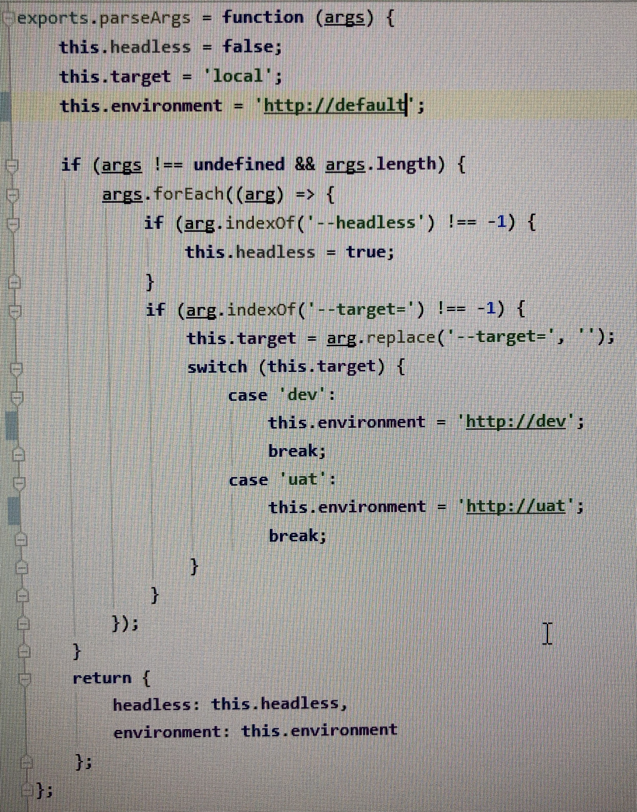
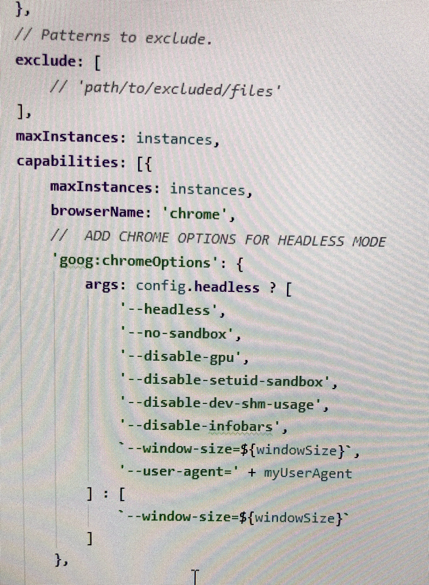
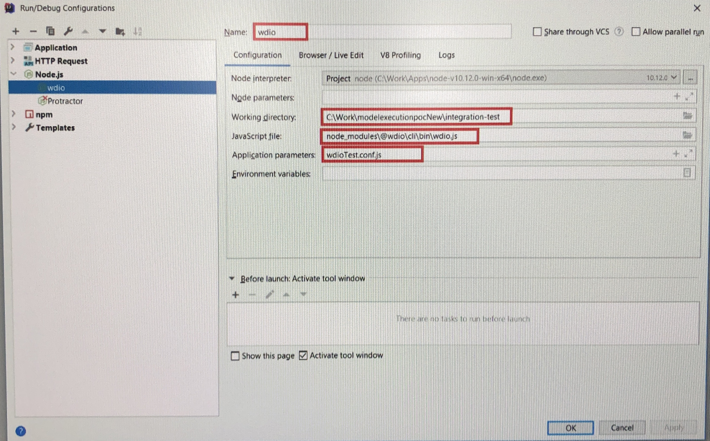

##How to run test from terminal using parameters

run ``npx wdio.conf.js --suite=all --target=dev --headless`` or ``npm run test``
#### Where
* ``--suite=`` is the name of the suite from ``wdio.conf.js`` that you want to run
* ``--target`` is an optional parameter for defining environment
* ``--headless`` is an optional parameter for running tests in headless mode
###!!! All parameters are not implemented yet !!!
#### For implementation them follow the instructions:

# How to run Tests in Debug Mode

